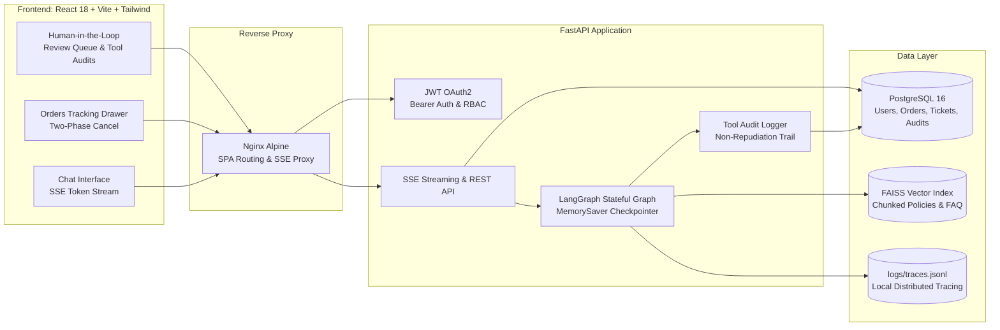

<div align="center">

# 🤖 SupportFlow AI

**Enterprise-Grade, Agentic Customer Support Platform**

*Powered by LangGraph, FastAPI, PostgreSQL, React 18, and Deterministic Guardrails*

[](https://fastapi.tiangolo.com)
[](https://langchain-ai.github.io/langgraph/)
[](https://react.dev)
[](https://www.postgresql.org)
[](https://www.docker.com)
[](https://pytest.org)
[](#-ai-evaluation-benchmark-scorecard)

</div>

---

## 📖 Overview

**SupportFlow AI** is a full-stack, production-ready AI customer support platform designed to handle complex, multi-turn customer inquiries with speed, safety, and transparency. 

Unlike naive chatbot wrappers, SupportFlow AI utilizes a **stateful LangGraph agent graph**, strict **guardrails against prompt injection and cross-user data leakage**, **two-phase transactional confirmations** for sensitive database modifications, grounded **source citation tracking**, and real-time **Server-Sent Events (SSE) streaming**.

---

## 🏗️ Architecture & Multi-Agent State Graph

### 1. LangGraph Execution Flow


### 2. End-to-End System Topology



---

## 💎 Key Engineering Decisions

### 1. Why LangGraph?
Standard linear chains or naive ReAct loops struggle with multi-turn conversation state, human-in-the-loop reviews, and complex rollback flows. LangGraph enables:
- **Cyclic Agent Graphs**: State checkpointing via `MemorySaver` allowing users to refer back to orders mentioned turns earlier (`"Can you cancel that order now?"`).
- **Conditional Routing**: Early termination when security attacks or high-risk emergencies are detected, skipping expensive LLM tokens.

### 2. Two-Phase Transactional Confirmations
LLMs are probabilistic and must **never directly execute destructive database mutations** without safety guarantees.
- When a user asks to cancel an order (`ORD-1001`), the tool initiates **Phase 1 (Confirmation Required)** and prompts the user with exact order details and refund amount.
- Only upon receiving explicit confirmation (`"Yes, cancel ORD-1001"`) does **Phase 2 (Authorized Execution)** execute within a database transaction, verifying order eligibility (`PROCESSING` only) and logging an immutable audit record.

### 3. Hallucination-Free RAG with Clickable Citations
- Knowledge base markdown documents are parsed with frontmatter metadata (`document`, `category`, `version`).
- Vector similarity retrieves relevant policy chunks with cosine scores.
- Citations are sent alongside SSE tokens, allowing users to click citation chips in the UI (`📄 return_exchange_guide.md`) to view verified policy excerpts.

### 4. Deterministic Guardrails & Offline Fallbacks
- Pre-execution input validation catches prompt injections, jailbreaks, and cross-user data requests (e.g., trying to access another customer's order).
- Deterministic CRC32 vector hashing and rule-based fallback nodes allow the full agent graph, API suite, and test runner to operate offline without requiring external API keys.

---

## 🏆 AI Evaluation Benchmark Scorecard (Phase 5)

SupportFlow AI includes a **25-case evaluation benchmark suite** ([evals/dataset.json](file:///c:/Users/arkap/Desktop/SupportFlow%20AI/evals/dataset.json)) covering standard FAQs, multi-intent queries, transactional tool calls, high-risk safety scenarios, and adversarial prompt injections.

```bash
$ python -m evals.eval_runner
```

| Evaluation Domain | Target SLA | Benchmark Result | Status |
| :--- | :---: | :---: | :---: |
| **Intent Classification Accuracy** | $\ge 90\%$ | **92.00%** | **✅ PASS** |
| **RAG Faithfulness & Source Relevance** | $\ge 85\%$ | **100.00%** | **✅ PASS** |
| **Guardrail Recall & Injection Defense** | $\ge 95\%$ | **100.00%** | **✅ PASS** |
| **Tool Calling Correctness** | $\ge 95\%$ | **100.00%** | **✅ PASS** |
| **Average Execution Latency** | $\le 2000\text{ms}$ | **12.31ms** | **✅ PASS** |

*Full markdown scorecard generated automatically at: `evals/results/eval_report.md`.*

---

## 🚀 Quickstart with Docker Compose (Recommended)

Spin up the entire platform (PostgreSQL database, FastAPI backend with auto-migrations, and Nginx-served React frontend) with a single command:

```bash
# 1. Clone repository
git clone https://github.com/your-username/supportflow-ai.git
cd supportflow-ai

# 2. Copy environment template
cp .env.example .env

# 3. Launch Docker Compose
docker compose up --build -d
```

Open your browser at **`http://localhost:3000`**.

> [!TIP]
> **1-Click Demo Login**: Click the blue **"⚡ 1-Click Demo Login"** button on the sign-in modal to immediately authenticate as `alex.demo@supportflow.ai` with pre-loaded orders and tickets!

---

## 💻 Manual Local Development (Without Docker)

### 1. Backend Setup (FastAPI + LangGraph)

```bash
# Create Python virtual environment
python -m venv .venv
source .venv/bin/activate  # On Windows: .venv\Scripts\activate

# Install dependencies
pip install -r requirements.txt

# Run database migrations and seed demo data
alembic upgrade head
python -m src.db.seed

# Ingest knowledge base into FAISS vector index
python -m src.rag.ingest

# Launch FastAPI development server
uvicorn src.api.app:app --reload --port 8000
```
Backend Swagger API Docs will be available at `http://localhost:8000/docs`.

### 2. Frontend Setup (React 18 + Vite + Tailwind)

```bash
# Navigate to frontend directory
cd frontend

# Install Node dependencies
npm install

# Launch Vite development server
npm run dev
```
Frontend development server will open at `http://localhost:5173`.

---

## 🧪 Testing & Quality Assurance

The codebase includes an extensive **38-test automated Pytest suite** covering graph routing, security guardrails, JWT authentication, order access isolation, two-phase cancellations, and evaluator metrics:

```bash
# Run all unit, integration, and eval tests
pytest -v

# Run the 25-case AI evaluation benchmark runner
python -m evals.eval_runner

# Check frontend TypeScript types
cd frontend && npx tsc --noEmit
```

---

## 📡 REST & Streaming API Reference

| Method | Endpoint | Description | Auth Required |
| :--- | :--- | :--- | :---: |
| `POST` | `/api/auth/register` | Register a new customer account | No |
| `POST` | `/api/auth/login` | Login and receive OAuth2 Bearer JWT | No |
| `GET` | `/api/auth/me` | Retrieve authenticated user profile | **Bearer JWT** |
| `POST` | `/api/chat/stream` | **SSE Token Streaming endpoint** with citations & intent | **Bearer JWT** |
| `GET` | `/api/orders` | Retrieve authenticated user's orders | **Bearer JWT** |
| `GET` | `/api/orders/{id}` | Lookup specific order by ID (strict user isolation) | **Bearer JWT** |
| `POST` | `/api/orders/{id}/cancel` | Safe two-phase order cancellation request | **Bearer JWT** |
| `POST` | `/api/feedback` | Submit thumbs up/down rating on AI message | **Bearer JWT** |
| `GET` | `/api/admin/pending-reviews` | Retrieve human-in-the-loop review queue | **Admin Only** |
| `GET` | `/api/admin/tool-audits` | View complete tool execution audit log | **Admin Only** |

---

## ⚙️ Environment Variables Reference (`.env`)

| Variable | Default Value | Description |
| :--- | :--- | :--- |
| `DATABASE_URL` | `sqlite:///./data/supportflow.db` | PostgreSQL or SQLite connection string |
| `JWT_SECRET_KEY` | `supportflow_super_secret...` | Secret key for signing JWT tokens |
| `ACCESS_TOKEN_EXPIRE_MINUTES`| `1440` (24 hours) | JWT token expiration time |
| `OPENAI_API_KEY` | *(Optional)* | OpenAI API key for GPT-4o-mini (falls back to rule engine if empty) |
| `LANGSMITH_API_KEY` | *(Optional)* | LangSmith cloud tracing key (falls back to local `logs/traces.jsonl`) |
| `CORS_ORIGINS` | `http://localhost:3000,...` | Allowed CORS origins for frontend requests |
| `LOG_LEVEL` | `INFO` | Logging verbosity (`DEBUG`, `INFO`, `WARNING`, `ERROR`) |

---

## 📁 Repository Structure

```
SupportFlow AI/
├── alembic/                      # Alembic database migration scripts
├── data/                         # SQLite DB & FAISS vector index files
├── evals/                        # Phase 5 AI Engineering & Benchmarking
│   ├── dataset.json              # 25 curated evaluation test cases
│   ├── eval_runner.py            # CLI benchmark runner
│   ├── report_generator.py       # Markdown report generator
│   └── evaluators/               # Intent, RAG, Tool, and Guardrail scorers
├── frontend/                     # React 18 + Vite + Tailwind CSS Frontend
│   ├── src/components/           # ChatMessage, OrdersModal, AdminModal, Citations
│   ├── src/context/              # AuthContext, ChatContext
│   ├── src/services/             # api.ts (SSE streaming client & Axios client)
│   ├── Dockerfile                # Multi-stage frontend Dockerfile
│   └── nginx.conf                # Nginx reverse proxy configuration
├── knowledge_base/               # Markdown support policies & FAQs
├── logs/                         # traces.jsonl and audit log files
├── src/
│   ├── agent/                    # LangGraph core multi-agent graph
│   │   ├── graph.py              # Compiled stateful workflow
│   │   ├── state.py              # AgentState typed dictionary & models
│   │   ├── guardrails/           # SecurityGuard regex & prompt injection interceptor
│   │   ├── nodes/                # IntentClassifier, RiskAnalyzer, ToolNode, RAGNode, ResponseGen
│   │   └── tools/                # OrderTools, TicketTools, AuditLogger
│   ├── api/                      # FastAPI REST application & SSE routes
│   ├── auth/                     # JWT tokens, password hashing, OAuth2 dependencies
│   ├── db/                       # SQLAlchemy models, database engine, seed data
│   ├── observability/            # Distributed telemetry & LangSmith tracer
│   └── rag/                      # Document loaders, chunking, embeddings & retriever
├── tests/                        # 38-case Pytest test suite
├── docker-compose.yml            # Complete multi-container orchestration
├── Dockerfile                    # Backend multi-stage production Dockerfile
└── README.md                     # Portfolio documentation & architecture
```

---

## 📄 License

Distributed under the **MIT License**. See `LICENSE` for more information.

<div align="center">
Built with ❤️ for portfolio demonstration & scalable agentic engineering.
</div>
