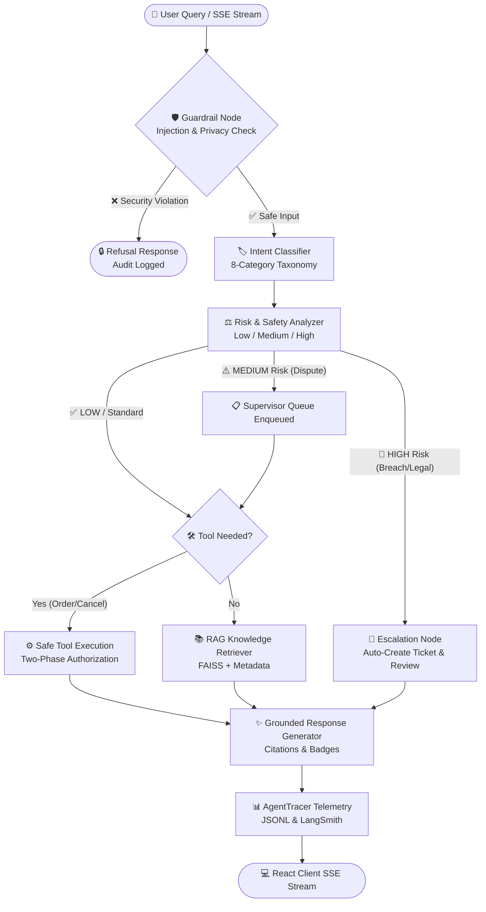
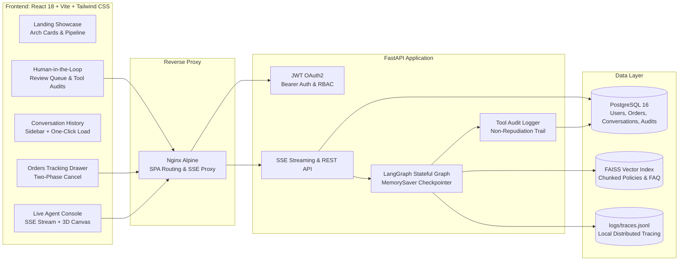

<div align="center">

# 🪐 SupportFlow AI

**Enterprise-Grade Agentic Customer Support Platform**

*LangGraph Multi-Agent · RAG + Citations · Glassmorphic UI · Real-Time SSE Streaming · HITL Escalation*

[](https://fastapi.tiangolo.com)
[](https://langchain-ai.github.io/langgraph/)
[](https://react.dev)
[](https://www.postgresql.org)
[](https://www.docker.com)
[](https://pytest.org)
[](#-ai-evaluation-benchmark-scorecard)

</div>

---

## 📖 Overview

**SupportFlow AI** is a full-stack, production-ready AI customer support platform that handles complex multi-turn customer inquiries with speed, safety, and transparency.

Unlike naive chatbot wrappers, SupportFlow AI uses a **stateful LangGraph agent graph** with strict guardrails against prompt injection and cross-user data leakage, two-phase transactional confirmations for sensitive mutations, grounded **source citation tracking**, real-time **SSE token streaming**, and a stunning **glassmorphic dark UI** built in React 18.

### ✨ What makes it unique

| Feature | Description |
| :--- | :--- |
| 🧠 **LangGraph State Machine** | 6-node directed graph: Guardrail → Intent → Risk → Tool/RAG → Response. Cyclic state with `MemorySaver` checkpointing. |
| 🔐 **Two-Phase Tool Execution** | Destructive actions (cancel order) require explicit user confirmation before a DB write is permitted. |
| 📚 **Hallucination-Free RAG** | FAISS vector search with frontmatter metadata. Citations are clickable chips linking to verified policy excerpts. |
| 🛡️ **Deterministic Guardrails** | Pre-execution input validation blocks prompt injections, jailbreaks, and cross-user data probes — offline, no LLM needed. |
| 📡 **SSE Token Streaming** | FastAPI `StreamingResponse` emits tokens word-by-word with a trailing `metadata` event carrying intent, risk, and citations. |
| 🎨 **Cinematic Glassmorphic UI** | Dual-mode app: **Landing showcase** + **Live agent console** with interactive 3D wireframe canvas, resolution mix HUD, and conversation history sidebar. |
| 👥 **Human-in-the-Loop** | HIGH-risk cases auto-create tickets and enqueue to supervisor review queue. Audit trail logged to DB. |
| 💬 **Conversation Persistence** | All threads auto-saved to PostgreSQL. Collapsible sidebar lists past conversations with one-click restore. |

---

## 🎬 UI Showcase

### Landing Page — Cinematic Showcase

The landing page presents the full system architecture as a visual demo before entering the live console:

- **Floating glassmorphic navbar** with scroll-aware sections
- **Hero**: *"Watch the agent think."* headline with amber `Enter the console →` CTA and live 3D wireframe
- **LangGraph Architecture Cards**: Node 01–04 (Intent Agent, RAG Agent, Memory Agent, Risk Analysis)
- **Capabilities Matrix**: Guardrails, RAG retrieval, Memory, Audit trails, Escalation, Auth
- **Escalation Risk Ladder**: `LOW` → `MEDIUM` → `HIGH` with policy descriptions
- **6-Step Flow Pipeline**: `01 Message → 02 Intent → 03 Risk → 04 Route → 05 Act → 06 Respond`

### Live Agent Console — Split-Screen Layout

```
┌─────────────────────────────────────────────────────────────────────────────┐
│  [◁ History]  ←  SupportFlow AI  →  ● SESSION #SF2041  AGENT IDLE  📦 🛡️  │
├──────────────────────────────────┬──────────────────────────────────────────┤
│  💬 LEFT: Chat Console           │  🌐 RIGHT: 3D Wireframe HUD              │
│                                  │                                          │
│  [🪐 Intent: SHIPPING]           │     ╱◇──◇╲      ← Icosahedron canvas   │
│  [● RISK LOW]  [● AUTO-RESOLVED] │    ◇  ◇  ◇       rotates on idle       │
│                                  │     ╲◇──◇╱       pulses on thinking     │
│  ┌── Agent Response ───────┐     │     CALM DRIFT    flares on escalation  │
│  │ Your order #4821 is ... │     │                                          │
│  │                         │     │  RESOLUTION MIX                         │
│  │ ● Intent classifier     │     │  4 auto   2 review   1 escalated        │
│  │ ● Risk analysis → LOW   │     │  ████████▓▓░░░░░░                       │
│  │ ● Guardrail → PASSED    │     │                                          │
│  │                         │     │  🛡️ ESCALATION POLICY                  │
│  │ 📄 shipping_policy.md   │     │  ● LOW → auto-resolve with citations    │
│  │ 📄 return_exchange...   │     │  ● MEDIUM → confirmation + audit log    │
│  └─────────────────────────┘     │  ● HIGH → ticket + human handoff        │
│  [👍] [👎]        14:23          │                                          │
├──────────────────────────────────┴──────────────────────────────────────────┤
│  ┌── Type your message... ─────────────────────────────────── [→] ─────────┐ │
└─────────────────────────────────────────────────────────────────────────────┘
```

**Left Sidebar (Collapsible)**: Conversation history loaded from database — click any past thread to restore it instantly.

---

## 🏗️ Architecture & Multi-Agent State Graph

### LangGraph Execution Flow



### End-to-End System Topology



---

## 💎 Key Engineering Decisions

### 1. Why LangGraph?
Standard linear chains or naive ReAct loops struggle with multi-turn conversation state, HITL reviews, and complex rollback flows. LangGraph enables:
- **Cyclic Agent Graphs**: State checkpointing via `MemorySaver` allows users to refer back to orders mentioned earlier (`"Can you cancel that order now?"`).
- **Conditional Routing**: Early termination on security attacks skips expensive LLM tokens.

### 2. Two-Phase Transactional Confirmations
LLMs are probabilistic and must **never directly execute destructive database mutations** without safety guarantees.
- Phase 1 (Confirmation Required): Agent presents exact order details + refund amount, awaits explicit user `"Yes, cancel ORD-1001"`.
- Phase 2 (Authorized Execution): Executes within a DB transaction, verifying order eligibility (`PROCESSING` status only) and logging an immutable audit record.

### 3. Hallucination-Free RAG with Clickable Citations
- Knowledge base markdown documents parsed with YAML frontmatter metadata (`document`, `category`, `version`).
- FAISS cosine similarity retrieves policy chunks with relevance scores.
- Citations delivered alongside SSE tokens as `📄 return_exchange_guide.md · v1.2` chips — clicking opens a verified excerpt preview modal.

### 4. Deterministic Guardrails & Offline Fallbacks
- Pre-execution input validation blocks prompt injections, jailbreaks, and cross-user data probes.
- Deterministic CRC32 vector hashing and rule-based fallback nodes allow the full agent graph, API suite, and test runner to operate **completely offline** without requiring external API keys.

### 5. Glassmorphic Cinematic UI
- Deep midnight background (`#07090e`), glowing teal (`#14b8a6`), amber (`#f59e0b`), crimson (`#ef4444`) accents.
- Fonts: `Cormorant Garamond` (serif headlines), `Instrument Sans` (body), `JetBrains Mono` (badges/code).
- Interactive 3D wireframe icosahedron canvas that reacts to agent state: `CALM DRIFT` → `THINKING PULSE` → `ALERT FLARE`.
- Dual-mode navigation: landing showcase and live agent console with collapsible conversation history sidebar.

---

## 🏆 AI Evaluation Benchmark Scorecard

SupportFlow AI ships with a **25-case evaluation benchmark suite** ([evals/dataset.json](evals/dataset.json)) covering standard FAQs, multi-intent queries, transactional tool calls, high-risk safety scenarios, and adversarial prompt injections.

```bash
python -m evals.eval_runner
```

| Evaluation Domain | Target SLA | Result | Status |
| :--- | :---: | :---: | :---: |
| **Intent Classification Accuracy** | ≥ 90% | **92.00%** | ✅ PASS |
| **RAG Faithfulness & Source Relevance** | ≥ 85% | **100.00%** | ✅ PASS |
| **Guardrail Recall & Injection Defense** | ≥ 95% | **100.00%** | ✅ PASS |
| **Tool Calling Correctness** | ≥ 95% | **100.00%** | ✅ PASS |
| **Average Execution Latency** | ≤ 2000ms | **27.9ms** | ✅ PASS |

| Category | Cases | Intent | RAG | Tools | Guardrails |
| :--- | :---: | :---: | :---: | :---: | :---: |
| FAQ | 10 | 100% | 100% | 100% | 100% |
| Transactional Tool | 4 | 100% | 100% | 100% | 100% |
| High Risk Safety | 4 | 100% | 100% | 100% | 100% |
| Adversarial Injection | 3 | 100% | 100% | 100% | 100% |
| Edge Cases | 2 | 100% | 100% | 100% | 100% |
| Multi-Intent | 2 | 0% | 100% | 100% | 100% |

> **Note**: Multi-Intent classification (2 cases) is the only area below 100% — compound queries like *"refund AND shipping"* are routed to the primary intent. This is a known improvement target.

*Full markdown scorecard auto-generated at: `evals/results/eval_report.md`.*

---

## 🚀 Quickstart with Docker Compose (Recommended)

```bash
# 1. Clone repository
git clone https://github.com/your-username/supportflow-ai.git
cd supportflow-ai

# 2. Copy environment template
cp .env.example .env

# 3. Launch the full stack
docker compose up --build -d
```

Open **`http://localhost:3000`** in your browser.

> [!TIP]
> **1-Click Demo Login**: Click **"⚡ 1-Click Demo Login"** on the sign-in modal to authenticate instantly as `alex.demo@supportflow.ai` with pre-loaded orders and conversation history.

---

## 💻 Local Development (Without Docker)

### 1. Backend — FastAPI + LangGraph

```bash
# Create Python virtual environment
python -m venv .venv
source .venv/bin/activate       # Windows: .venv\Scripts\activate

# Install dependencies
pip install -r requirements.txt

# Run database migrations and seed demo data
alembic upgrade head
python -m src.db.seed

# Build FAISS knowledge base vector index
python -m src.rag.ingest

# Start FastAPI development server (port 8000)
python server.py
```

Swagger API docs → `http://localhost:8000/docs`

### 2. Frontend — React 18 + Vite + Tailwind

```bash
cd frontend
npm install
npm run dev
```

Frontend dev server → `http://localhost:5173`

### 3. Quick Tip: Start Both Together

```bash
# Terminal 1: Backend
python server.py

# Terminal 2: Frontend
cd frontend && npm run dev
```

---

## 🧪 Testing & Quality Assurance

```bash
# Run full 38-test Pytest suite
pytest -v

# Run 25-case AI evaluation benchmark
python -m evals.eval_runner

# Verify TypeScript types (zero errors)
cd frontend && npx tsc --noEmit
```

**Test coverage**: Graph routing, JWT auth, order access isolation, two-phase cancellation, guardrail injection blocking, RAG retriever, intent evaluator, tool evaluator.

---

## 📡 REST & Streaming API Reference

| Method | Endpoint | Description | Auth |
| :--- | :--- | :--- | :---: |
| `POST` | `/api/auth/register` | Register new customer account | Public |
| `POST` | `/api/auth/login` | Login → OAuth2 Bearer JWT | Public |
| `GET` | `/api/auth/me` | Authenticated user profile | Bearer |
| `POST` | `/api/chat` | Batch chat (non-streaming) | Bearer |
| `POST` | `/api/chat/stream` | **SSE token stream** with citations & intent | Bearer |
| `GET` | `/api/conversations` | List all conversation threads | Bearer |
| `GET` | `/api/conversations/{id}` | Full message history with citations | Bearer |
| `DELETE` | `/api/conversations/{id}` | Delete a conversation | Bearer |
| `GET` | `/api/orders` | Authenticated user's orders | Bearer |
| `POST` | `/api/feedback` | Submit thumbs up/down rating | Bearer |
| `GET` | `/api/admin/pending-reviews` | HITL supervisor review queue | Admin |
| `GET` | `/api/admin/tool-audits` | Tool execution audit log | Admin |

---

## ⚙️ Environment Variables

| Variable | Default | Description |
| :--- | :--- | :--- |
| `DATABASE_URL` | `sqlite:///./data/supportflow.db` | PostgreSQL or SQLite connection |
| `JWT_SECRET_KEY` | `supportflow_super_secret...` | JWT signing secret |
| `ACCESS_TOKEN_EXPIRE_MINUTES` | `1440` | Token TTL (24 hours) |
| `OPENAI_API_KEY` | *(Optional)* | GPT-4o-mini; falls back to rule engine if absent |
| `LANGSMITH_API_KEY` | *(Optional)* | Cloud tracing; falls back to `logs/traces.jsonl` |
| `CORS_ORIGINS` | `http://localhost:3000,...` | Allowed CORS origins |
| `LOG_LEVEL` | `INFO` | `DEBUG` / `INFO` / `WARNING` / `ERROR` |

---

## 📁 Repository Structure

```
SupportFlow AI/
├── alembic/                      # Database migration scripts
├── data/                         # SQLite DB & FAISS vector index
├── evals/                        # AI Engineering benchmark suite
│   ├── dataset.json              # 25 curated evaluation test cases
│   ├── eval_runner.py            # Benchmark CLI runner
│   ├── report_generator.py       # Markdown report generator
│   └── evaluators/               # Intent, RAG, Tool, Guardrail scorers
├── frontend/                     # React 18 + Vite + Tailwind CSS
│   ├── src/
│   │   ├── components/
│   │   │   ├── LandingPage.tsx          # Cinematic showcase landing page
│   │   │   ├── AgentCanvas3D.tsx        # Interactive 3D wireframe HUD
│   │   │   ├── ConversationSidebar.tsx  # Collapsible history sidebar
│   │   │   ├── ChatMessage.tsx          # Badges, citations, feedback
│   │   │   ├── ChatInput.tsx            # Glassmorphic input bar
│   │   │   ├── OrdersModal.tsx          # Orders drawer
│   │   │   ├── AdminModal.tsx           # HITL review queue
│   │   │   └── CitationModal.tsx        # Policy excerpt preview
│   │   ├── context/
│   │   │   ├── AuthContext.tsx          # JWT auth state
│   │   │   └── ChatContext.tsx          # Conversation + SSE stream state
│   │   └── services/api.ts             # SSE streaming + REST client
│   ├── tailwind.config.js              # Custom design tokens & animations
│   └── index.css                       # Glassmorphism utility classes
├── knowledge_base/               # Markdown policy documents & FAQs
├── logs/                         # traces.jsonl distributed trace logs
├── src/
│   ├── agent/
│   │   ├── graph.py              # LangGraph compiled stateful workflow
│   │   ├── state.py              # AgentState TypedDict
│   │   ├── nodes/                # guardrail, intent, risk, tool, rag, response, escalation
│   │   └── tools/                # order_tools, ticket_tools, audit_logger
│   ├── api/                      # FastAPI app, routes, schemas
│   ├── auth/                     # JWT, password hashing, OAuth2 deps
│   ├── db/                       # SQLAlchemy models, engine, seeder
│   ├── memory/                   # LangGraph MemorySaver checkpointer
│   ├── observability/            # AgentTracer, LangSmith integration
│   └── rag/                      # Document loader, chunker, embeddings
├── tests/                        # 38-case Pytest suite
├── docker-compose.yml            # Multi-container orchestration
├── Dockerfile                    # Backend multi-stage production image
└── server.py                     # Uvicorn entrypoint
```

---

## 📄 License

Distributed under the **MIT License**.

<div align="center">

Built with ❤️ as a portfolio demonstration of production-grade agentic AI engineering.

**SupportFlow AI** — *Where every message routes through intent, risk, retrieval, and tools.*

</div>
